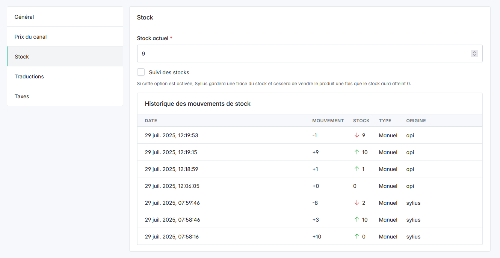

<p align="center">
  <a href="http://www.aropixel.com/">
    
  </a>
</p>

## Aropixel Sylius Stock Movement Plugin

Log and display the product stock movements. When the stock of a product is updated, the stock movement will be saved 
and displayed in the admin product stock tab. The origin of the stock update is also displayed (either a new order or a manual update).

## Installation

##### *We work on stable, supported and up-to-date versions of packages. We recommend you to do the same.*

```bash
composer require aropixel/sylius-stock-movement-plugin
```

##### Add plugin dependencies to your `config/bundles.php` file:

```php
return [
    ...
    Aropixel\SyliusStockMovementPlugin\AropixelSyliusStockMovementPlugin::class => ['all' => true],
];
```

##### Import required config in your `config/packages/_sylius.yaml` file:
```yaml
# config/packages/_sylius.yaml

imports:
    ...

    - { resource: "@AropixelSyliusStockMovementPlugin/config/config.yaml" }
```

##### Import routing in your `config/routes.yaml` file:

```yaml

# config/routes.yaml
...

aropixel_sylius_stock_movement_plugin:
    resource: "@AropixelSyliusStockMovementPlugin/config/routing.yaml"
```

- Add the StockMovement interface and trait to your ProductVariant entity: 

```php
    ...
    
    namespace App\Entity\Product;

    ...
    
    use Aropixel\SyliusStockMovementPlugin\Entity\ProductVariantMovementInterface;
    use Aropixel\SyliusStockMovementPlugin\Entity\ProductVariantMovementTrait;
    ... 
    
    /**
     * @ORM\Entity
     * @ORM\Table(name="sylius_product_variant")
     */
    class ProductVariant extends BaseProductVariant implements ProductVariantMovementInterface
    {
        use ProductVariantMovementTrait;

    ...
```

- Generate and execute the db migrations

## Screenshots



